# Acinar Analysis & GUI

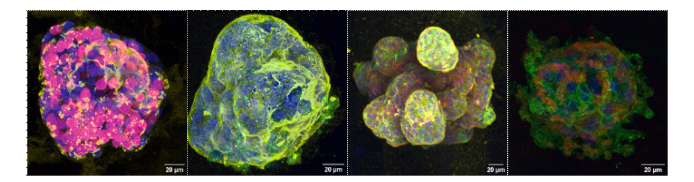

## Overview

GUI to aid quantification of 3D acinar images in the Gilmore lab. All analysis is on full 3D volumes, not 2D projections. Possible quantification includes:

1. Acinar shape/size
2. Cell/nucleus shape/size
3. Protein polarisation across the acinus (used in our case to understand the (mis)localisation of basement membrane proteins)
4. Apoptosis (C3* staining)
5. Proliferation (EdU staining)
6. Mitochondria analysis (amount/location within cells)
7. Protein colocalisation (with nuclear and membrane markers)
8. Protein subcellular localisation (within binarised membrane/nuclear compartments)
9. Nuclear protein localisation (within individual nuclei, and the position of those nuclei across an acinus)

More niche workflows are also available

10. Protein proximity (to dying and non dying cells)
11. Actin upregulation (at the acinus exterior vs an interior shell)

**Note:** The majority of our analysis was performed on acini embedded in their native microenvironment. Embedding gels differ in both their mechanical and optical properties, which can substantially affect measured fluorescence intensities. Furthermore, variability in the depth of acini within the gels can lead to significant disparities in the observed fluroescence intenisty. We therefore focus on protein localisation within an acinus, rather than quantifying absolute fluorescence intensities in such variable environments.

  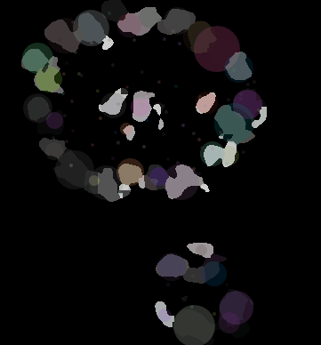
  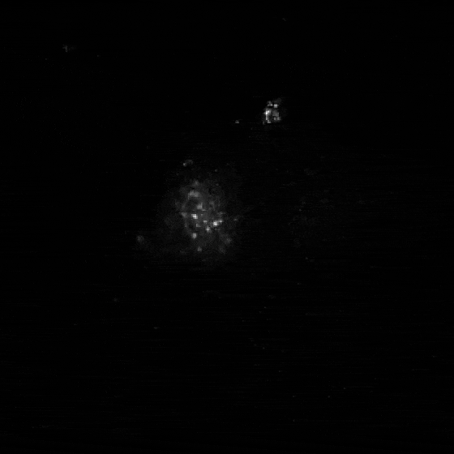
  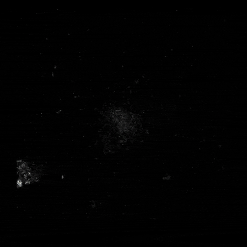

Launch the GUI using GUI_launcher.ipynb.

## Creating Masks
- Some analyses require pre-segmentation of nuclei/membrane (see requirements table at the end of this README). We use the Labkit (FIJI plugin) workflow setout below, but the same outcome can likely be achieved using newer tools (e.g. Cellpose/SAM). To offset the signal attenuation in deeper z-slices, we use the following workdlow:
1. Split z-stacks into top (bright) and bottom (dim) halves.
2. Train separate [Labkit](https://imagej.net/plugins/labkit/) classifiers in FIJI/ImageJ for each half.
3. Segment, then concatenate top + bottom masks into full-stack masks.
4. Save masks in separate folders per channel (one mask TIFF per image TIFF, matched alphabetically).

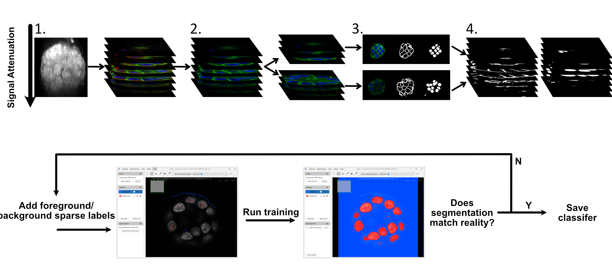

## Shared Step: Acinus Segmentation

Every analysis begins by identifying the primary acinus in the image. The pipeline enables splitting of neighbouring acini and luminal filling. The pipeline:

1. **Builds an acinus approximation:** by summing the nuclear + membrane channels (plus any active stain channels like C3, EdU, mito).
2. **Downscales:** default 0.25× isotropic resolution for more managable processing speed.
3. **Clips and smooths**: rescale 10-85% range, then Gaussian smoothing.
4. **Thresholds:** Uses Li's method and keeps the largest connected component.
5. **Fills holes:** each Z-slice is filled to ensure that any hollow luminal region is captured as part of the acinus.
6. **Sphericity check:** code attempts to split neighbouring acini (quantifying only the largest, centrally located one) while leaving genuinely non-spherical acini intact. This is achieved by checking for low sphericity items: if sphericity is low, splitting is attempted using erosion (and subsequent expansion so volume is not lost). If objects are only tangential, this should split them, whereas "true" non-spherical acini are maintained. 
7. **Final erosion** (ball radius 5) offsets any expansion from smoothing/filling, then a final largest-component filter.

The result is a binary 3D mask used by all downstream analyses.

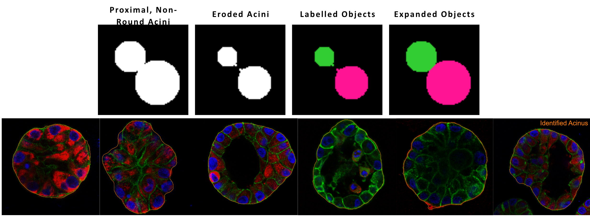

## Analysis Modules

### 1. Acinus Shape/Size

|                             |                                                  |
| --------------------------- | ------------------------------------------------ |
| **What it measures**  | Acinus volume (µm³) and roundness (sphericity) |
| **GUI checkbox**      | Acinus Shape                                     |
| **Required folders**  | Image folder only                                |
| **Required channels** | None                                             |

**How it works:** Uses the shared acinus segmentation, then computes volume from voxel count × voxel size³ and roundness as the ratio of the smallest to largest [inertia tensor eigenvalue](https://pydocs.github.io/p/skimage/0.17.2/api/skimage.measure._moments.inertia_tensor_eigvals.html) (1.0 = perfect sphere).

**Output columns:**

| Column                | Description                                                                |
| --------------------- | -------------------------------------------------------------------------- |
| `acinus_volume_um3` | Total acinus volume in µm³                                               |
| `acinus_roundness`  | Eigenvalue ratio (closer to 1 = more spherical)                            |
| `flag`              | `None`, `hole` (internal cavity detected), or `multiple_acini_split` |

**QC plot:** Mid-Z slice showing the acinus mask boundary overlaid on the raw image.

---

### 2. Cell & Nuclear Shape

|                             |                                                                                    |
| --------------------------- | ---------------------------------------------------------------------------------- |
| **What it measures**  | Per-cell and per-nucleus volume, roundness, and cell–cell neighbour relationships |
| **GUI checkbox**      | Cell & Nuclear Shape                                                               |
| **Required folders**  | Nuclear Mask Folder, Membrane Mask Folder                                          |
| **Required channels** | None                                                                               |

**How it works:**

1. Rescales nuclear and membrane binary masks to acinus resolution and restricts them to the acinus boundary.
2. **Nuclei:** Nuclei are identified and holes filled. A distance-transform watershed is used to split touching nuclei
3. **Cells:** Membrane mask is watershed segmented using the nuclear centroids as seeds. Resulting labels are expanded within the acinus to fill gaps (due to wide membrane segmentation)
4. Each nucleus is matched to its enclosing cell by centroid lookup.
5. Cell–cell neighbour counts are computed via voxel adjacency along all three axes.

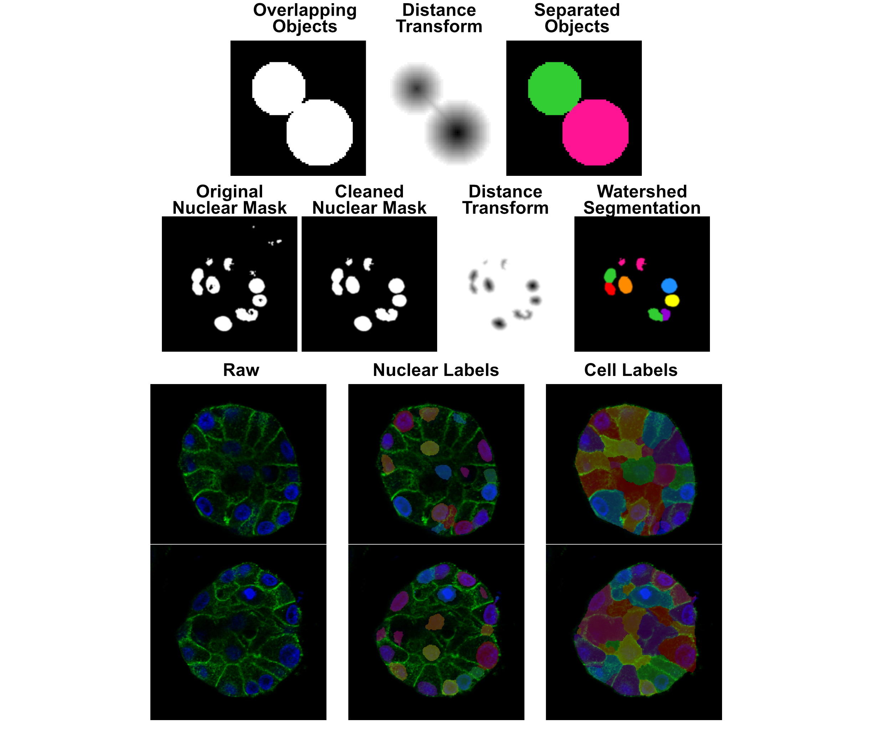

**Output columns:**

| Column                                      | Description                             |
| ------------------------------------------- | --------------------------------------- |
| `nucleus_label`, `cell_label`           | Integer IDs                             |
| `nucleus_volume_um3`, `cell_volume_um3` | Volumes in µm³                        |
| `nucleus_roundness`, `cell_roundness`   | Eigenvalue ratios                       |
| `nucleus_cell_volume_ratio`               | Nucleus vol / cell vol                  |
| `sum`                                     | Total neighbour count                   |
| `external`                                | Neighbours touching the acinus boundary |
| `internal`                                | Neighbours entirely within the acinus   |

**QC plot:** Mid-Z nuclear labels + cell labels colour-coded on the raw image.

---

### 3. Protein Polarisation
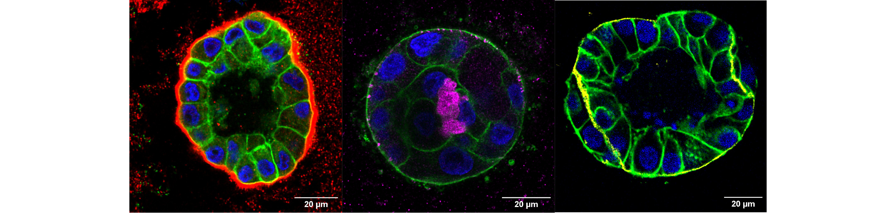

We used this to quantify the (mis-)localisation of proteins away from the acinus exterior, but it can be used for polarisation of any protein **relative to the acinus exterior**.

|                             |                                                                                      |
| --------------------------- | ------------------------------------------------------------------------------------ |
| **What it measures**  | How protein intensity varies with radial distance from the acinus centre to its edge |
| **GUI checkbox**      | Protein Polarisation                                                                 |
| **Required folders**  | None                                                                                 |
| **Required channels** | Protein Channel (≥ 0)                                                               |

**How it works:**

1. Acinus mask is expanded (5px) to include protein on the acinar exterior. Protein of interest is masked within the acinus (so this code does not measure protein mislocalisation into the surrounding ECM, only internalisation).
2. A distance transform from the acinus exterior is used to calculate the protein intensity at each (binned and rescaled) distance.

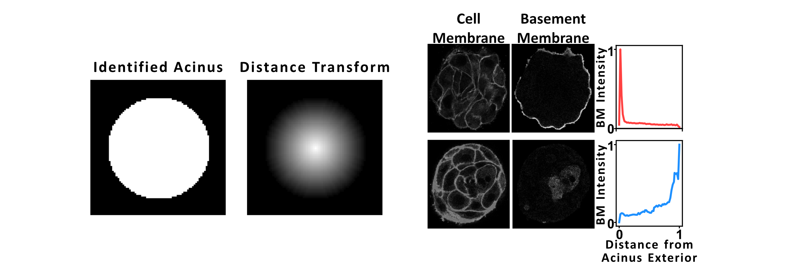

**Output columns:**

| Column                | Description                                                   |
| --------------------- | ------------------------------------------------------------- |
| `rounded_distance`  | Normalised radial distance (0 = edge, larger = deeper inside) |
| `protein_intensity` | Mean protein intensity in that distance bin                   |

**QC plot:** Acinus mask overlay with the protein channel shown in red.

---

### 4. Apoptosis (C3)

|                             |                                                                                            |
| --------------------------- | ------------------------------------------------------------------------------------------ |
| **What it measures**  | Number and spatial distribution of C3-positive (apoptotic) cells, plus total nuclear count |
| **GUI checkbox**      | Apoptosis (C3)                                                                             |
| **Required folders**  | C3 Mask Folder, Nuclear Mask Folder                                                        |
| **Required channels** | C3 Channel (≥ 0)                                                                          |

**How it works:**

1. Watershed-segments C3 mask objects within the acinus (7 µm separation, 1.3 µm min radius).
2. Watershed-segments nuclear mask objects (6 µm separation, 2 µm min radius).
3. Computes a distance map normalised 0–1 from the acinus boundary.
4. Records each C3 object's volume and normalised distance from the acinus edge.

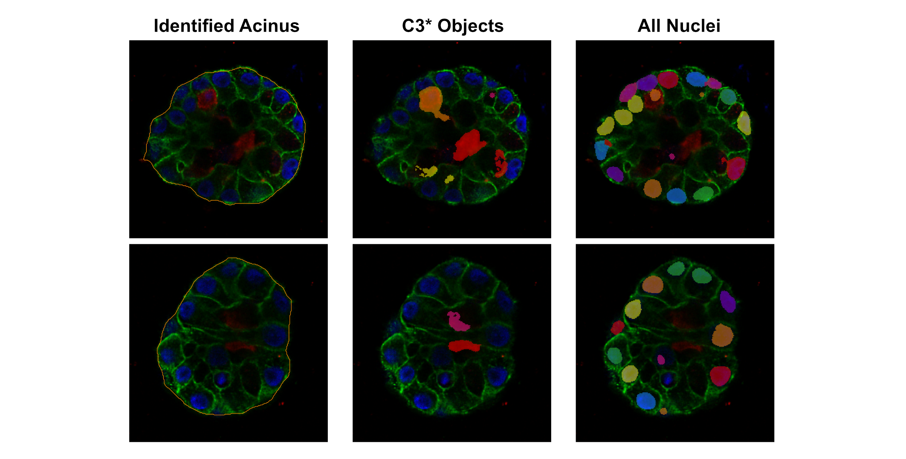

**Output columns:**

| Column                                      | Description                                       |
| ------------------------------------------- | ------------------------------------------------- |
| `label`                                   | C3 object ID (or`no_c3` if none found)          |
| `c3_volume_um3`                           | Volume of each C3+ object                         |
| `normalised_distance`                     | Position within acinus (0 = boundary, 1 = centre) |
| `acinus_volume_um3`, `acinus_roundness` | Acinus-level metrics                              |
| `number_of_nuclei`                        | Total nuclei detected in the acinus               |

**QC plot:** Acinus mask + colour-coded C3 labels + colour-coded nuclear labels.

---

### 5. Proliferation (EdU)

|                             |                                                                                  |
| --------------------------- | -------------------------------------------------------------------------------- |
| **What it measures**  | Number and spatial distribution of EdU-positive (dividing) vs non-dividing cells |
| **GUI checkbox**      | Proliferation (EdU)                                                              |
| **Required folders**  | EdU Mask Folder, Nuclear Mask Folder                                             |
| **Required channels** | EdU Channel (≥ 0)                                                               |

**How it works:**

1. **Dividing cells** = EdU mask objects, watershed-segmented (4 µm separation, 2 µm min radius).
2. **Non-dividing cells** = nuclei that are DAPI positive but EdU negative (nuclear mask minus dilated EdU mask, watershed-segmented).
3. Computes normalised distance of each cell from the acinus boundary.

**Output columns:**

| Column                                       | Description                   |
| -------------------------------------------- | ----------------------------- |
| `dividing`                                 | `Y` (EdU+) or `N`         |
| `cell_volume_um3`                          | Individual cell volume        |
| `normalised_distance`                      | Position within acinus (0–1) |
| `acinus_volume_um3`, `acinus_roundness`  | Acinus-level metrics          |
| `number_dividing`, `number_not_dividing` | Cell counts per acinus        |

**QC plot:** Acinus mask + colour-coded dividing cells + colour-coded non-dividing cells.

---

### 6. Mitochondria Analysis

|                             |                                                                                                                             |
| --------------------------- | --------------------------------------------------------------------------------------------------------------------------- |
| **What it measures**  | Per-cell mitochondrial count, total mito volume, mito-to-cell volume ratio, and mito distance distribution from the nucleus |
| **GUI checkbox**      | Mitochondria                                                                                                                |
| **Required folders**  | Nuclear Mask Folder, Membrane Mask Folder, Mito Mask Folder                                                                 |
| **Required channels** | None                                                                                                                        |

**How it works:**

1. Labels and size-filters the mito mask (min 10 voxels), rescales to acinus resolution.
2. Segments nuclei and cells (same as Cell & Nuclear Shape).
3. For each nucleus, finds mito objects overlapping its watershed territory.
4. Distance-bins mito pixels from the nucleus surface within the cell boundary.
5. Filters implausible cells (mito/cell vol ratio > 0.5, nucleus/cell vol ratio > 0.9, or zero mito volume).

**Output columns:**

| Column                                                                 | Description                                           |
| ---------------------------------------------------------------------- | ----------------------------------------------------- |
| `nucleus_label`, `cell_label`                                      | Integer IDs                                           |
| `nucleus_volume_um3`, `cell_volume_um3`                            | Volumes                                               |
| `number_of_mito`                                                     | Mito objects per cell                                 |
| `mito_volume_um3`                                                    | Total mito volume per cell                            |
| `mito_cell_vol_ratio`                                                | Mito vol / cell vol                                   |
| `mean_mito_distance_ratio`                                           | Mean mito pixel density per distance bin from nucleus |
| `acinus_volume_um3`, `total_mito_volume_um3`, `number_of_nuclei` | Acinus-level summaries                                |

**QC plot:** Acinus mask + cell labels + mito labels.

---

### 7. Protein Colocalisation

|                             |                                                                            |
| --------------------------- | -------------------------------------------------------------------------- |
| **What it measures**  | Pairwise Pearson correlation between channel intensities within the acinus |
| **GUI checkbox**      | Protein Colocalisation                                                     |
| **Required folders**  | Image folder only                                                          |
| **Required channels** | None (correlates every channel present)                                    |

**How it works:**

1. Uses the shared acinus segmentation to isolate the acinus.
2. Rescales each channel to acinus resolution and applies a light 3×3×3 uniform (mean) filter to suppress single-voxel noise.
3. Keeps only the voxels **inside** the acinus mask, so background voxels don't inflate the correlation.
4. Computes the Pearson correlation coefficient between every pair of channels across those in-acinus voxels.

Each channel is labelled by its configured role (`nuclear`, `membrane`, `protein`, `c3`, `edu`, `mito`) where set, otherwise `channelN`. A correlation near **+1** means the two markers co-localise (bright in the same voxels), near **0** means no linear relationship, and near **−1** means they are mutually exclusive.

**Output columns:** the correlation matrix is returned in long form, one row per channel.

| Column                 | Description                                                                |
| ---------------------- | ------------------------------------------------------------------------- |
| `channel`            | The channel this row refers to (role name or `channelN`)                  |
| one column per channel | Pearson correlation of `channel` against that channel (1.0 on the diagonal) |
| `flag`               | Acinus segmentation flag                                                   |

**QC plot:** Mid-Z slice showing the acinus mask boundary overlaid on the raw image (red = protein channel).

---

### 8. Protein Subcellular Localisation

|                             |                                                                                       |
| --------------------------- | ------------------------------------------------------------------------------------- |
| **What it measures**  | Fraction of total protein signal in the membrane, nucleus, and cytoplasm compartments |
| **GUI checkbox**      | Protein Subcellular Localisation                                                      |
| **Required folders**  | Nuclear Mask Folder, Membrane Mask Folder                                             |
| **Required channels** | Protein Channel (≥ 0)                                                                |

**How it works:**

1. Rescales the protein channel and both masks to acinus resolution and restricts them to the acinus.
2. Segments individual **nuclei** (`segment_nuclei`) and **cell territories** (`segment_cells`, a membrane-seeded watershed) — the same segmentation used by *Cell & Nuclear Shape*.
3. Builds boolean compartment masks: **membrane** = the cell–cell boundaries dilated by one voxel, **nucleus** = the segmented nuclei with membrane overlap removed, and **cytoplasm** = acinus − membrane − nucleus.
4. Sums the protein signal in each compartment and reports each as a fraction of the total.

Unlike *Nuclear Protein Localisation*, this reports one row per acinus (compartment fractions), not per nucleus.

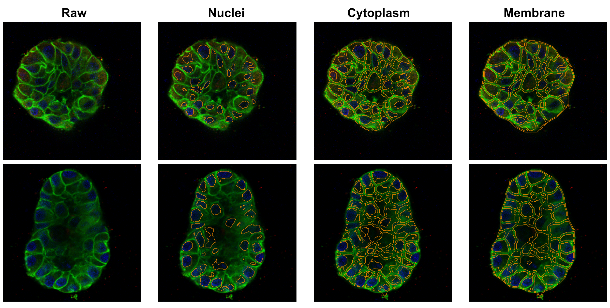

**Output columns:**

| Column                | Description                                       |
| --------------------- | ------------------------------------------------- |
| `nuclear_fraction`  | Fraction of protein signal in nuclei              |
| `membrane_fraction` | Fraction of protein signal in the membrane        |
| `cyto_fraction`     | Fraction of protein signal in the cytoplasm       |
| `total`             | Sum of the three fractions (≈ 1.0; sanity check) |
| `flag`              | Acinus segmentation flag                          |

**QC plot:** Mid-Z nucleus, cytoplasm, and membrane masks overlaid on the raw image (red = protein channel).

---

---

### 9. Nuclear Protein Localisation

|                             |                                                                                    |
| --------------------------- | ---------------------------------------------------------------------------------- |
| **What it measures**  | Per-nucleus protein intensity and each nucleus's radial position within the acinus |
| **GUI checkbox**      | Nuclear Protein Localisation                                                       |
| **Required folders**  | Nuclear Mask Folder                                                                |
| **Required channels** | Protein Channel (≥ 0)                                                             |

**How it works:**

1. Rescales the protein channel and the nuclear mask to acinus resolution and restricts them to the acinus.
2. **Segments individual nuclei** via distance-transform watershed (4 µm min separation), then filters out nuclei smaller than a 2 µm-radius sphere.
3. Builds a distance transform from the acinus boundary, normalised 0–1 (0 = boundary, 1 = deepest interior).
4. For each nucleus, sums the protein signal, divides by volume for a mean, and looks up its centroid's normalised distance.

**Output columns:**

| Column                                         | Description                                             |
| ---------------------------------------------- | ------------------------------------------------------- |
| `nucleus_label`                              | Integer nucleus ID                                      |
| `centroid-0`, `centroid-1`, `centroid-2` | Nucleus centroid (z, y, x)                              |
| `nuclear_volume_um3`                         | Nucleus volume in µm³                                 |
| `nuclear_protein_intensity`                  | Total protein signal in the nucleus                     |
| `av_nuclear_protein_intensity`               | Protein signal per µm³                                |
| `corresponding_distance_matrix`              | Normalised radial position (0 = boundary, 1 = interior) |
| `acinus_volume_um3`                          | Total acinus volume                                     |
| `number_of_nuclei`                           | Nuclei detected in the acinus                           |
| `flag`                                       | Acinus segmentation flag                                |

**QC plot:** Mid-Z nuclear labels overlaid on the raw image (red = protein channel).

### 10. Protein Proximity

|                             |                                                                   |
| --------------------------- | ----------------------------------------------------------------- |
| **What it measures**  | Intensity of a chosen protein near dying (C3+) vs non-dying cells |
| **GUI checkbox**      | Protein Proximity                                                 |
| **Required folders**  | C3 Mask Folder, Nuclear Mask Folder                               |
| **Required channels** | C3 Channel (≥ 0), Proximity Protein Channel (≥ 0)               |

**How it works:**

1. Classifies cells as **dying** (C3 mask objects) or **non-dying** (nuclear mask minus dilated C3 mask).
2. Watershed-segments both populations within the acinus.
3. Builds estimated cell territories (expand labels × 20), then expands each territory by a search radius (default 5 µm).
4. Measures the proximity-protein intensity both inside each cell and in its surrounding neighbourhood.

**Output columns:**

| Column                                    | Description                           |
| ----------------------------------------- | ------------------------------------- |
| `dying`                                 | `Y` (C3+) or `N`                  |
| `proximity_intensity_in_cell`           | Total protein signal within the cell  |
| `proximity_intensity_around_cell`       | Signal in neighbourhood minus in-cell |
| `proximity_mean_intensity_in_cell`      | Mean intensity within cell            |
| `proximity_mean_intensity_neighborhood` | Mean intensity in full neighbourhood  |
| `estimated_cell_territory_volume_um3`   | Cell territory volume                 |
| `proximity_neighborhood_volume_um3`     | Neighbourhood volume                  |
| `number_dying`, `number_not_dying`    | Cell counts per acinus                |

**QC plot:** Acinus mask + colour-coded dying cells + colour-coded non-dying cells.

---

### 11. Membrane Upregulation

|                             |                                                                                               |
| --------------------------- | --------------------------------------------------------------------------------------------- |
| **What it measures**  | Whether membrane-channel signal is enriched at the acinus periphery compared to deeper inside |
| **GUI checkbox**      | Membrane Upregulation                                                                         |
| **Required folders**  | None                                                                                          |
| **Required channels** | Membrane Channel (≥ 0)                                                                       |

**How it works:**

1. Computes a distance transform from the acinus boundary inward.
2. Defines an **edge shell** (currently 0–3 µm from boundary) and an **inner shell** (currently 8–11 µm from boundary; i.e. 3 µm shell + 5 µm gap + 3 µm shell).
3. Measures the **median** membrane-channel intensity in each shell.
4. Computes the ratio (edge median / inner median). Values > 1 indicate peripheral enrichment.

**Output columns:**

| Column                                                | Description                                  |
| ----------------------------------------------------- | -------------------------------------------- |
| `acinus_volume_um3`, `acinus_roundness`           | Acinus-level metrics                         |
| `membrane_edge_shell_median`                        | Median membrane intensity in the outer shell |
| `membrane_inner_shell_median`                       | Median membrane intensity in the inner shell |
| `membrane_edge_to_inner_ratio`                      | Edge / inner (NaN if inner = 0)              |
| `edge_shell_volume_um3`, `inner_shell_volume_um3` | Shell volumes                                |

**QC plot:** Acinus mask + edge shell region + inner shell region overlaid on raw image (red = membrane channel). Title shows the ratio value.

## Requirements Summary Table

| Analysis                         | Mask Folders Needed     | Channels Needed (≥ 0) |
| -------------------------------- | ----------------------- | ---------------------- |
| Acinus Shape                     | —                      | —                     |
| Cell & Nuclear Shape             | Nuclear, Membrane       | —                     |
| Protein Polarisation             | —                      | Protein                |
| Apoptosis (C3)                   | C3, Nuclear             | C3                     |
| Protein Proximity                | C3, Nuclear             | C3, Proximity Protein  |
| Proliferation (EdU)              | EdU, Nuclear            | EdU                    |
| Mitochondria                     | Nuclear, Membrane, Mito | —                     |
| Membrane Upregulation            | —                      | Membrane               |
| Nuclear Protein Localisation     | Nuclear                 | Protein                |
| Protein Subcellular Localisation | Nuclear, Membrane       | Protein                |
| Protein Colocalisation           | —                      | —                     |

---